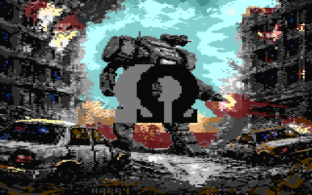

# R2PL Deltafill



## What is this?

This is the source code of [my contribution](https://youtu.be/NpHyrDOa1-s?t=538) for the [Return to Promised Land](https://plus4world.powweb.com/software/Return_to_Promised_Land) winning Commodore Plus/4 demo, released at Árok 2026.

The effect is a filled, rotating Omega symbol over a bitmap. I call the technique deltafill because it updates only the pixels that actually change from one frame to the next. It uses a set of horizontal sine plotters that draw either the object color or the background pixels along the object's edges. The tricky part is determining when each plotter should be active. To avoid doing that work at runtime, the on/off state switch points are precomputed. That's essentially the whole technique on a high level.

## Build

You need `Docker` installed on your system to build the project. On Linux you can simply build with

```sh
 $ sh mk.sh
```

The build environment is the `adotsch/dev6502` Docker image. The project uses GNU Make, Java and the [ASL Macroassembler](http://john.ccac.rwth-aachen.de:8000/as/), that are all included in the image.

## Files

The source code in this repo is the last version of the code before linking. 

 - [omega2x.txt](omega2x.txt): the Omega object as a simple TXT file
 - [plotters.asm](plotters.asm): macro definitions for horizontal plotter routines
 - [sintab.asm](sintab.asm): sinus table for plotter routines (generated)
 - [renderer.asm](renderer.asm): object renderer speedcode, and plotter on/off switch logic (generated)
 - `*.java`: the source code of the java program that generates the above two files
 - [renderer0.asm](renderer0.asm) and [renderer1.asm](renderer1.asm): the renderer code split into two parts for memory layout reasons
 - [Makefile](Makefile): a standard makefile for building the project
 - [Mech.prg](Mech.prg): background multicolor image
 - [Mech_omega.prg](Mech_omega.prg): background + omega object at the initial position as a multicolor image
 - [main.asm](main.asm): the main source file, links everything together and creates the program that runs the animation
 - [main.prg](main.prg): the final executable PRG file, entry at $3000
 - [main_exo.prg](main_exo.prg): the same, compressed with Exomizer